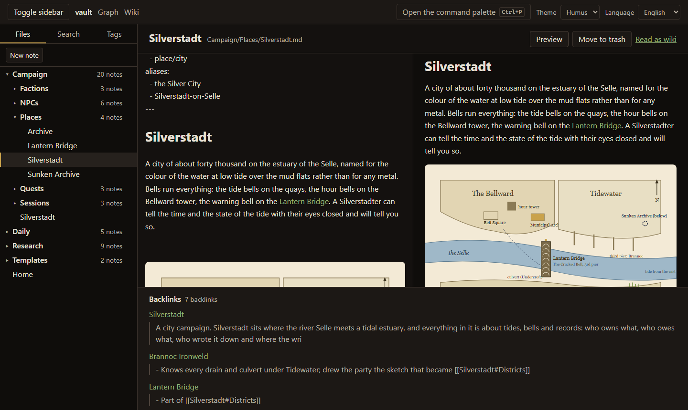
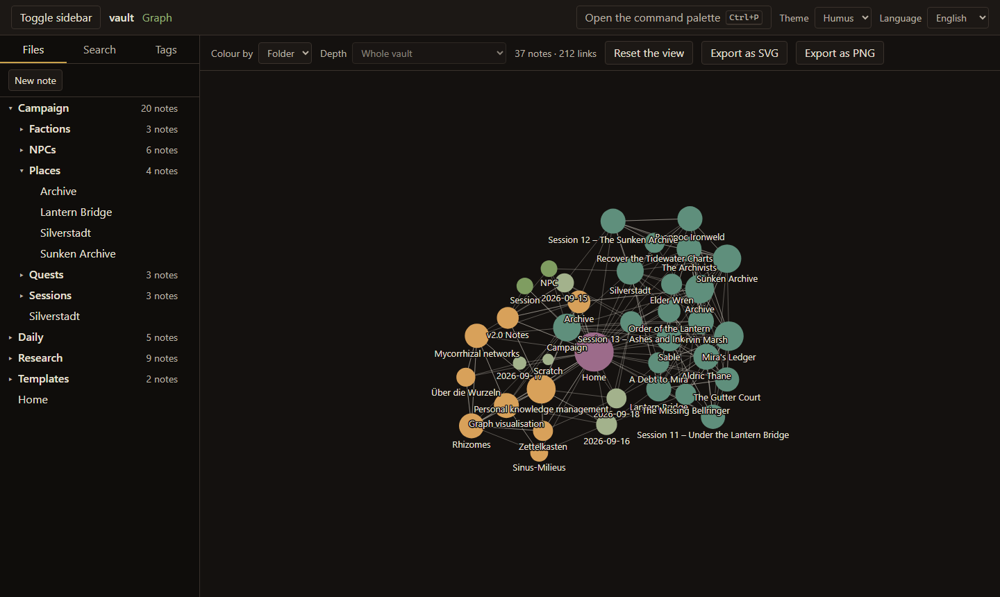
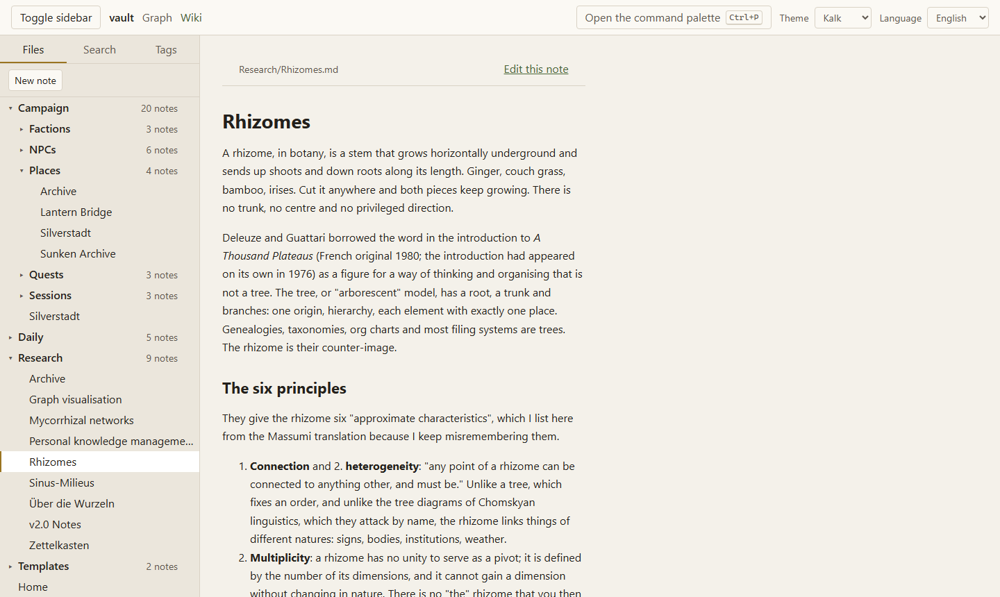

<div align="center">


# Rhizom

**Networked knowledge, kept in plain Markdown files.**

A self-hostable tool that reads a folder of Markdown files, indexes the links between them and
draws the vault as a field of bubbles — notes as circles, folders and tags as colour, links as
connections. Every vault doubles as a navigable wiki.

[](https://github.com/lokianer/rhizom/actions/workflows/ci.yml)
[](LICENSE)
[](package.json)
[](https://github.com/lokianer/rhizom/releases/latest)
[](ROADMAP.md)

[Project page](https://lokianer.github.io/rhizom/) · [Roadmap](ROADMAP.md) ·
[Decisions](DECISIONS.md) · [Changelog](CHANGELOG.md) · [Contributing](CONTRIBUTING.md)

</div>

---

> **Early development.** Phase 1 of six is what you can run today: open a vault, write, link,
> search, and see the field. Phase 2 — the knowledge layer — is being built now. Everything up
> to the end of Phase 5 is a `0.x`: the format a vault is written in may still move. Keep a
> backup of your notes.

## A look at it

|                                                                                                                     |                                                                                                                 |
| ------------------------------------------------------------------------------------------------------------------- | --------------------------------------------------------------------------------------------------------------- |
|  | **Writing.** The note on the left, the same note rendered on the right, every link that points here underneath. |
|                         | **The field.** A bubble per note, its size the number of links, its colour the folder or the tag.               |
|                           | **Reading.** Wiki mode, in the light theme called Kalk: the vault to read rather than to write.                 |

## Principles

- **Files first.** The Markdown files in your vault folder are the source of truth. SQLite is
  only a derived index (links, tags, frontmatter, full text) that can be rebuilt at any time. A
  Rhizom vault stays readable without Rhizom, and an existing Obsidian vault — a folder of `.md`
  files with `[[wikilinks]]` — opens directly.
- **Local and private.** No telemetry, no mandatory cloud, no third-party accounts. Run it on
  your own machine or server.
- **For people who think in connections:** the self-hosting community, researchers, authors, and
  D&D game masters.

## Quick start

Rhizom serves one vault: a folder of Markdown files, for example an existing Obsidian vault.
Notes are read and written as files; the SQLite index next to them can be deleted at any time.

### With Docker

```
RHIZOM_VAULT=/path/to/your/vault docker compose up
```

Then open <http://localhost:3737>. Without `RHIZOM_VAULT` the container serves the example vault
from `examples/vault`. The container reads and writes your notes as user 1000 and keeps its index
in a named volume (`rhizom-data`) that can be deleted at any time. The port is published on the
loopback interface only — there is no login yet — so set `RHIZOM_BIND=0.0.0.0` to reach it from
other machines, ideally behind a reverse proxy.

### From a build, without a toolchain

Every run of CI attaches a ready-to-run package to its summary page: the
[latest run on `main`](https://github.com/lokianer/rhizom/actions/workflows/ci.yml?query=branch%3Amain)
→ **Artifacts** → `rhizom-<commit>`. One package runs on Linux, macOS and Windows; unpack it and:

```
cd server
RHIZOM_VAULT_DIR=../example-vault node dist/server.js
```

### From source

Node ≥ 22.22 and [pnpm 12](https://pnpm.io/installation):

```
pnpm install
pnpm build
RHIZOM_VAULT_DIR=/path/to/your/vault NODE_ENV=production pnpm --filter @rhizom/server start
```

<details>
<summary><b>Settings</b> — every one an environment variable</summary>

On Windows PowerShell, set them with `$env:RHIZOM_VAULT_DIR = 'C:\notes'`.

| Variable              | Default                             | Meaning                                                             |
| --------------------- | ----------------------------------- | ------------------------------------------------------------------- |
| `RHIZOM_VAULT_DIR`    | `examples/vault` outside production | The folder with your notes                                          |
| `RHIZOM_DATA_DIR`     | `./data`                            | Where the SQLite index lives; it is derived data and safe to delete |
| `RHIZOM_TEMPLATE_DIR` | the vault's own setting             | The folder templates live in, when the vault does not say           |
| `PORT`, `HOST`        | `3737`, `localhost`                 | Where to listen                                                     |
| `LOG_LEVEL`           | `info`                              | pino log level                                                      |
| `NODE_ENV`            | —                                   | `production` turns off the example-vault fallback and pretty logs   |

The REST API is documented at <http://localhost:3737/api/docs>; the OpenAPI document is served at
`/api/openapi.json` and committed as [`apps/server/openapi.json`](apps/server/openapi.json).

</details>

## What Rhizom does, and will do

Phase 1 is what you can run today; the later phases are planned. The
[roadmap](ROADMAP.md) has the detail.

| Area             | Highlights                                                                                             | Phase |
| ---------------- | ------------------------------------------------------------------------------------------------------ | ----- |
| Editor           | CodeMirror 6 with live preview, `[[` autocomplete with fuzzy search, create notes from missing links   | 1 ✓   |
| Bubble graph     | Size by link degree, clusters by folder or tag, local graph, tag filters, SVG/PNG export               | 1 ✓   |
| Wiki mode        | Read-only view of the whole vault with rendered links, navigation and full-text search                 | 1 ✓   |
| Knowledge        | Definitions with glossary and hover tooltips, unlinked mentions, transclusion, templates, query blocks | 2     |
| Milieu axes      | Two freely named axes; drag a note and its frontmatter values follow                                   | 2     |
| D&D mode         | Stat blocks, typed relationships, reveal markers, a player view, dice and decks — enabled per vault    | 3     |
| Sharing          | Multi-user permissions, publish flag per note, static HTML export, version history, PWA                | 4     |
| Desktop & more   | Electron installers, CLI, OpenAPI docs, theme system, spaced repetition, maps, fantasy calendar        | 5     |
| Everything after | Vault health, sync-conflict files, scale measured at 20,000 notes, git sync, a written-down format     | 6     |

Everything is reachable from the keyboard: <kbd>Ctrl</kbd>/<kbd>⌘</kbd>+<kbd>P</kbd> opens the
command palette, <kbd>Ctrl</kbd>/<kbd>⌘</kbd>+<kbd>S</kbd> saves at once (notes autosave anyway),
and the file tree, search results and palette are usable without a mouse.

## Themes

Two themes ship with Rhizom: **Humus** (dark, earthy — the default) and **Kalk** (light, chalky).
Both are defined as CSS custom properties in
[`apps/web/src/styles/tokens.css`](apps/web/src/styles/tokens.css); cluster colours for the graph
can later be overridden per folder or tag.

<details>
<summary><b>Development</b></summary>

```
pnpm install        # dependencies and git hooks
pnpm dev            # core (watch build), server (tsx watch) and web (Vite) in parallel
pnpm test           # unit tests for all packages
pnpm e2e            # Playwright (run `pnpm --filter @rhizom/web exec playwright install chromium` once)
pnpm lint && pnpm typecheck && pnpm format:check
pnpm package        # a runnable build in dist/package
```

The workspace: `packages/core` (types, Markdown and link parsing, index logic — no UI),
`apps/server` (Fastify REST API, also serves the web app), `apps/web` (React + Vite). Read
[CONTRIBUTING.md](CONTRIBUTING.md) before opening a pull request and [DECISIONS.md](DECISIONS.md)
for the reasoning behind the stack.

</details>

## License

[AGPL-3.0-only](LICENSE). If you run a modified Rhizom as a service, the license requires you to
publish your changes.
