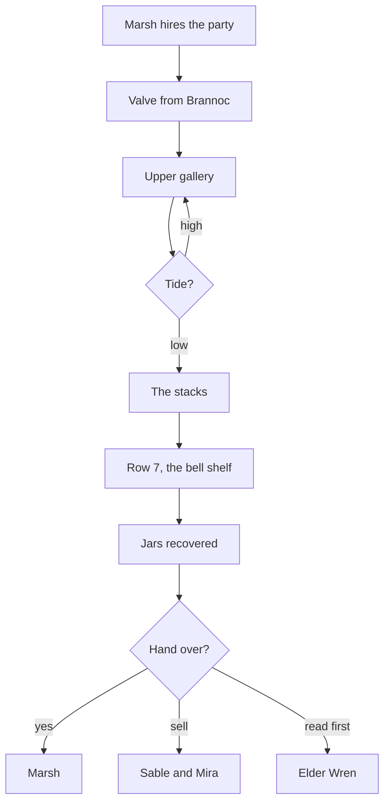

# Recover the Tidewater Charts

The job [[Corvin Marsh]] hired the party for: go into the stacks of the [[Sunken Archive]] at low tide and bring back a set of sealed jars from a shelf he could describe but not reach. Done in [[Session 12 – The Sunken Archive]]; the party has not yet handed the charts over, which is why the quest is complete and the situation is not.

## Tasks

- [x] Get a replacement valve from [[Brannoc Ironweld]] for the pump
- [x] Descend to the stacks at low tide
- [x] Find the shelf (row 7, marked with a bell)
- [x] Recover the jars before the tide bell
- [ ] Deliver the charts to Marsh
- [ ] Or do not

## What the charts are

Six vellum sheets in three jars, tide tables for the lower Archive going back to the drowning, drawn by someone who could get down to the vault level. They show a long cycle: the vault door is above water for a few days every thirty-one years, next in about six weeks of campaign time.

## Flow of the job as run

## Complications that came up

The party cut it close on the tide. Dagny carried the jars and Orrin, in that order. The ink eels are now a running joke.
