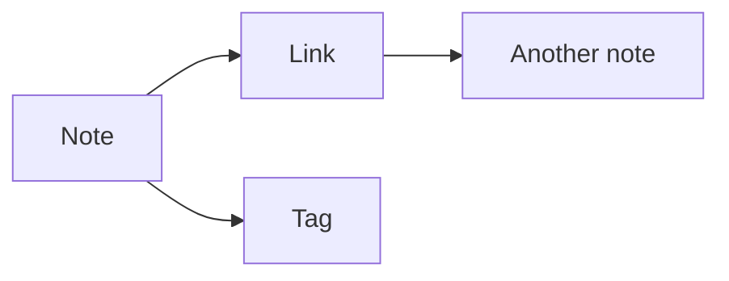

# How to use Rhizom

Everything Rhizom can do, on one page. It is an ordinary note in this vault, so you can read it
here, edit it, break it and delete it — and every example below is live: the callouts are
callouts, the query block is answering, the diagram is drawn.

> [!note] The short version
> A vault is a folder of Markdown files. Rhizom reads it, builds an index beside it, and gives
> you an editor, a wiki and a graph on top. The files stay the truth; the index can be deleted
> at any time and is rebuilt on the next start.

## Writing

The editor hides the Markdown syntax on every line except the one the cursor is on, so a note
reads like the thing it is while you work in it.

| Keys | What happens |
| --- | --- |
| `Ctrl/⌘ + S` | Save now. Notes autosave anyway, about a second after you stop typing. |
| `Ctrl/⌘ + F` | Find. `Ctrl/⌘ + H` opens replace with it. |
| `Ctrl/⌘ + B`, `+ I` | Bold, italic. A second press takes the markers back off. |
| `Ctrl/⌘ + K` | Turns the selection into a link and puts the cursor where the address goes. |
| `Ctrl/⌘ + P` | The command palette: everything in this document has an entry there. |
| `Enter` in a list | Continues the list. `Tab` indents, `Shift + Tab` goes back out. |

Drag an image into the editor, or paste one from the clipboard, and it lands in `assets/` with a
link written where you dropped it.

**Preview** puts the rendered note beside the text. **Rename or move…** is described further
down. **Move to trash** puts the note in `.trash/`, which Rhizom never indexes, so nothing is
destroyed by a mis-click.

### The slash menu

Type `/` at the start of a line or after a space:

- `/table` — a table with the cursor in its first cell
- `/definition` — marks this note as one, by writing `type: definition` into its frontmatter
- `/date`, `/time` — today, in the format this vault is set to
- …and every note in the vault's template folder, by name

A template is just a note in that folder. Inside one, these stand in for something:

`{{title}}` the new note's name · `{{date}}` and `{{time}}`, each with an optional format such as
`{{date:DD.MM.YYYY}}` · `{{path}}` · `{{cursor}}` where the cursor should end up ·
`{{roll:2d6+3}}` a dice roll, made once, when the text is inserted.

### Zen and Vim

**Zen mode** takes away the header, the sidebar and the shelves under the editor. Escape brings
them back. It is not remembered between visits.

**Vim mode** is off by default and switched on from the palette. It brings its own mode line, and
Escape then means what Vim means by it rather than leaving zen.

## Linking

`[[Silverstadt]]` links by name, `[[Campaign/Places/Silverstadt]]` by path, and
`[[Silverstadt|the city]]` shows your own words. A link to a note that does not exist yet is
marked; clicking it creates the note. `[[Silverstadt#Districts]]` points at a heading, and
`[[Silverstadt#^abc123]]` at one block of it.

A block id is written at the end of the block it belongs to — a paragraph, a list item, a whole
quotation — and is hidden when the note is read. `![[Silverstadt#^abc123]]` shows that one block
here. What counts as the block is the outermost thing the marker ends: a list item rather than
the list around it, a whole table rather than the row, because a row cut out of a table is a
line with pipes in it.

You do not have to write the id yourself. **Copy a link to this block**, in the palette or with
`Ctrl/⌘ + Shift + X`, gives the block under the cursor an id if it has none and puts the link
on the clipboard. The id is made of the block's first words, so both ends of the link say what
they point at. A heading and a code block are refused, and say why: a heading already answers to
`[[Note#Heading]]`, and in code the marker would be code.

Ordinary Markdown links to `.md` files work too, and count as links everywhere Rhizom counts
them.

**Backlinks** sit under the editor: every note that points here, with the line it says it on.

**Unlinked mentions** sit beneath those: every note that names this one — by its title or any
alias — without a link leading here. Tick the ones you mean and press the button, and the links
are written in one go. A name inside a link, a code span or the frontmatter is not a mention, and
a name broken across two lines is shown but cannot be linked, because a wikilink may not contain
a line break.

> [!tip] Aliases
> `aliases: [the Silver City]` in a note's frontmatter gives it another name. Links resolve
> through it, the glossary lists it, and the mention scan looks for it.

### Renaming and moving

**Rename or move…** in the note's header. Renaming and moving are the same operation, and both
change what a link means, so Rhizom shows you what it would do before it does anything: which
files change, on which line, and what each link would read afterwards.

Two kinds of link are deliberately left alone. One that reached the note through an alias keeps
its word — the alias has nothing to do with the file's name. And a short `[[Mira]]` that would
still find the note at its new place is not touched, which is why moving a note into a folder
usually changes no other file at all.

> [!warning] What a rename cannot see
> Reference definitions, raw HTML and links inside HTML comments never reach the parser, so they
> are not rewritten and cannot even be counted. The dialog says so rather than pretending.

## The knowledge layer

### Definitions and the glossary

Give a note `type: definition` and its title — and every alias — becomes a term of the vault.
Wherever that word appears in prose, it is marked, and hovering it shows the note's first block.
The **Glossary** in the header lists every definition alphabetically. It is a view of the index,
not a file, so it cannot go stale.

A definition never marks itself in its own text, and a term inside a link, a code span or the
frontmatter is left alone.

### Transclusion

`![[Ledger]]` shows that note here instead of linking to it. `![[Silverstadt#Districts]]` shows
one section of it. A note that embeds itself, a cycle between two notes, or a page with too many
embeds says so in place of the body rather than failing.

### Query blocks

A fenced block marked `rhizom-query` is answered from the index every time the note is opened:

```rhizom-query
type: definition
as: cards
```

Ten keys, and nothing else: `from` a folder, `type`, `tag`, `title` as plain text, `linksTo`,
`where` for your own frontmatter fields, `sort`, `limit`, `as` (`list`, `table` or `cards`) and
`columns`. Lists mean "any of these", and everything given is required together.

There is no expression language, on purpose. A vault can come from anywhere — a shared
repository, a colleague's archive — and opening one should never be the moment it starts running
something. A key Rhizom does not know is reported underneath the block, with its line, and the
rest of the block still answers.

### Smart folders

A note with `type: query` **is** a saved search. It appears in the sidebar above the file tree,
and unfolding it runs the block inside it. Because it is a note, the search travels with the
vault and can be edited in any editor.

### Tags

`#campaign/silverstadt/npcs` is three levels, not one long word. The **Tags** tab nests them, and
asking for a level asks for everything under it — filtering by `campaign` finds a note that only
ever wrote `campaign/silverstadt/npcs`. A level nobody wrote on its own is still shown, because
that row is how you ask for both of its children at once.

Reaching for a tag shows a pencil beside it: that renames the tag in every note that carries it,
under the same rules a note rename works by — a dry run first, then the write, and a file that
changed meanwhile is reported rather than overwritten. A level takes the levels under it with
it, in the prose and in the frontmatter alike, and a tag in a code block stays where it is.

> [!warning] Renaming onto a tag that exists merges the two
> A tag is only its name, so afterwards nothing remembers there were two of them. The dialog
> says which tags it would merge with before you press anything.

### Daily notes

**Today's note** in the palette opens the note for today, making it from this vault's own daily
template if it is not there yet. Where those notes live and what a day is called comes from the
vault: an `RHIZOM_DAILY_DIR` setting, Obsidian's `daily-notes.json`, or simply a folder called
`Daily`.

### Milieu fields

A note with `type: axes` lays part of the vault out between two axes you name — see
[[Milieus of Silverstadt]]. Six flat keys say what the axes are and what their ends are called, a
query block says which notes belong in the field, and each note carries its own position in its
own frontmatter.

Dragging a note there writes that position into its file. It is the only gesture in Rhizom that
changes a file by itself, so it writes once when you let go, refuses if the note changed on disk
meanwhile, and says so.

## Frontmatter

The fold above the editor shows every key of the open note as a field — text, number, yes-or-no,
date or list — and keys can be added and removed. It is folded away to start with, because the
frontmatter is already three lines above your cursor; the form is for changing it.

Only the values you change are rewritten. Comments, blank lines, the order you put the keys in
and your choice of quoting all come through exactly as they were. A nested value is shown and
left alone rather than flattened, and a frontmatter block no parser understands is reported
rather than overwritten.

Rhizom reserves four values of `type:` — `definition`, `template`, `query` and `axes` — and
otherwise the frontmatter is yours.

## Reading

### Callouts

> [!example] They look like this
> `> [!warning] A title` on the first line of a blockquote. Thirteen kinds, and the spellings
> Obsidian uses fold onto them, so a vault written there opens right.

> [!question]- A minus sign after the bracket folds it away
> You just opened this one. A plus sign instead leaves it foldable but open, and neither leaves
> it open and fixed. A foldable callout is a `<details>`, so it still works with JavaScript
> switched off.

### Diagrams

A fenced block marked `mermaid` is drawn:



The library is fetched the first time a diagram is on screen, so a vault without one never
downloads it.

### Task lists

- [x] Read this far
- [ ] Tick this box in the preview beside the editor
- [ ] Notice that only the box changed, and the rest of the line is where it was

In the wiki the same boxes are a picture of what the file says, because the wiki is read-only.

### The outline

The **Outline** tab lists the open note's headings and follows it as you write. Clicking one
jumps the rendered view to it, and so does any `[[Note#Heading]]` link.

## Seeing the whole vault

**Graph** in the header draws the vault as a field of bubbles: one per note, its size the number
of links, its colour the folder or the tag. Depth 1–3 shows only the neighbourhood of the open
note. Tags filter it. Both layouts export as SVG or PNG.

**Wiki** reads the vault without the editor: rendered links, navigation and search, nothing
writable.

**Search** in the sidebar is full text across every note, with the matches marked in the snippet.
It also finds a note by the aliases it declares, ranked just below a match in the title — so
searching for "the Silver City" finds Silverstadt, which is the name half this vault uses.

The palette has two more ways in: **Open a random note**, worth stumbling through a vault with,
and **Duplicate this note**, which names the copy the way a file manager would.

## Running it

Rhizom serves one vault and keeps its index in a folder of its own.

| Setting | What it does |
| --- | --- |
| `RHIZOM_VAULT_DIR` | The folder to serve. An Obsidian vault works as it is. |
| `RHIZOM_DATA_DIR` | Where the index goes. Delete it any time; it is rebuilt. |
| `PORT`, `HOST` | Where it listens. 3737 on localhost by default. |
| `RHIZOM_TEMPLATE_DIR`, `RHIZOM_DAILY_DIR` | Override what the vault says about itself. |

Nothing leaves the machine: no telemetry, no account, no cloud service.

> [!info] Where to look next
> [[Home]] is this vault's front door. [[Open questions]] shows query blocks doing real work, and
> [[Milieus of Silverstadt]] is a milieu field with the campaign's people in it.
